## Remove data from prometheus
```
curl -XPOST http://10.40.0.200:9090/api/v1/admin/tsdb/clean_tombstones
curl -XPOST "http://10.40.0.200:9090/api/v1/admin/tsdb/delete_series?match[]=eventRxManagerA&match[]=eventTxManagerA"
curl -XPOST "http://10.40.0.200:9090/api/v1/admin/tsdb/delete_series?match[]=eventRxManagerA&match[]=eventTxManagerA&match[]=eventTxDroppedManagerA&match[]=eventRxManagerB&match[]=eventTxManagerB&match[]=eventTxDroppedManagerB&match[]=eventRxManagerC&match[]=eventTxManagerC&match[]=eventTxDroppedManagerC"
```

# Summary
|file/attempt|remark|
|---|---|
|[main.cpp](main.cpp)||
|[app1.cpp](app1.cpp)||
|[app2.cpp](app2.cpp)||
|[app3.cpp](app3.cpp)|<ul><li>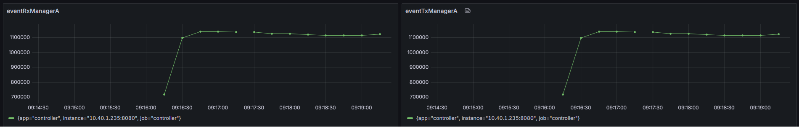</li><li>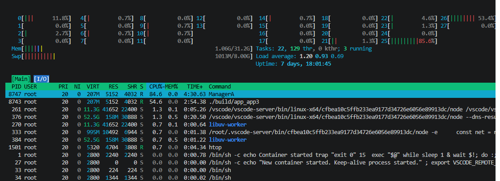</li><li>Protect shared list using mutex</li><li>Very low performance</li></ul>|
|[app4.cpp](app4.cpp)|<ul><li>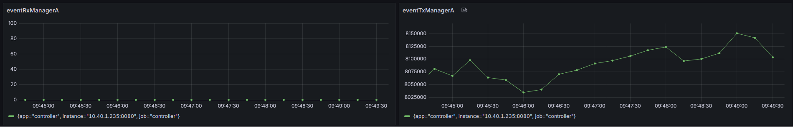</li><li>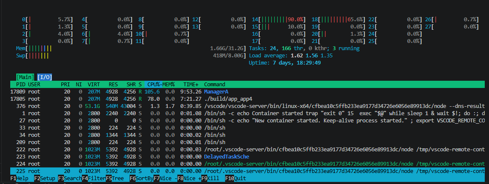</li><li>Trying to get sense how max we can go without muxtex</li></ul>|
|[app5.cpp](app5.cpp)|<ul><li>Attempt to use moodycamel::ReaderWriterQueue</li></ul>|
|[app6.cpp](app6.cpp)|<ul><li>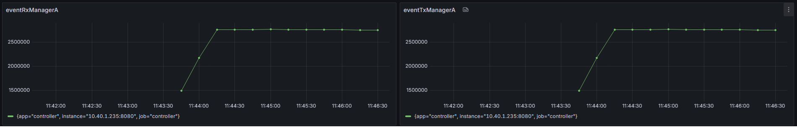</li><li>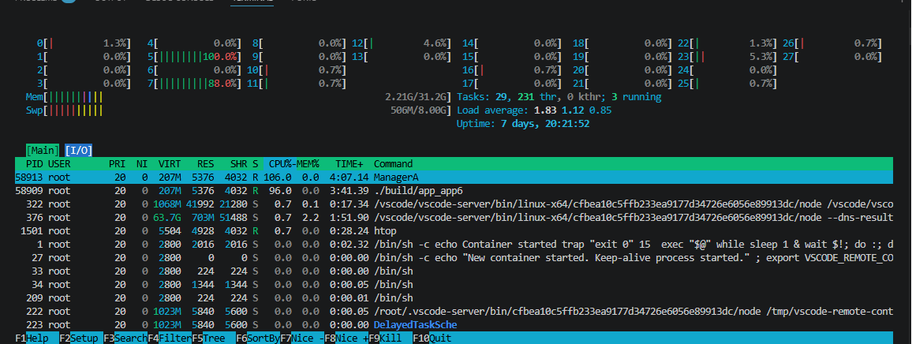</li><li>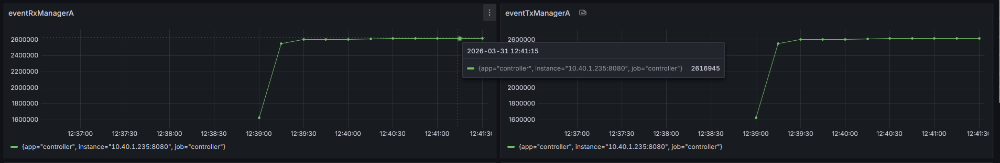</li><li>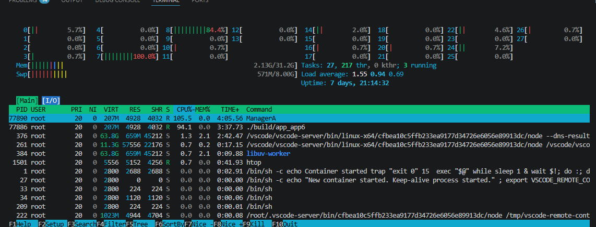</li><li>Protect shared list using Our implimentation of lock free queue using atomic variables</li><li>Perormace is better then [app3.cpp](app3.cpp) </li></ul>|
|[app7.cpp](app7.cpp)|<ul><li>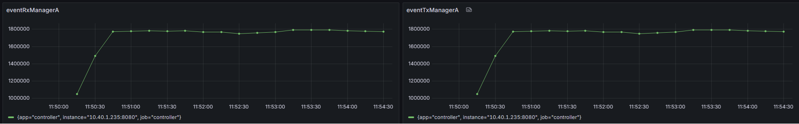</li><li>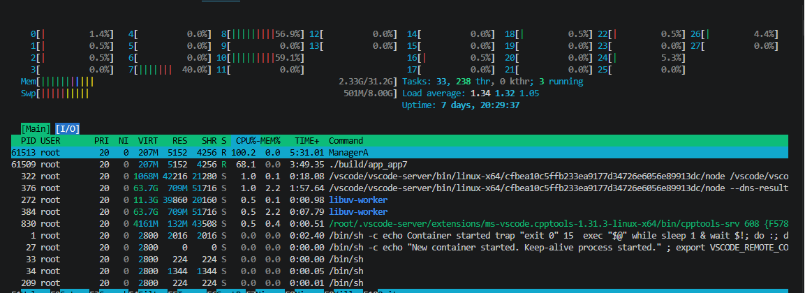</li><li>Protect shared list using mutex via proxy and wrapper pattern.</li><li>Perormace is better then [app3.cpp](app3.cpp) and less then [app6.cpp](app6.cpp) </li></ul>|
|[app8.cpp](app8.cpp)||
|[app9.cpp](app9.cpp)|Using moodycamel::ConcurrentQueue|
|[app10.cpp](app10.cpp)|<ul><li>Using atomic_queue::AtomicQueueB2</li><li>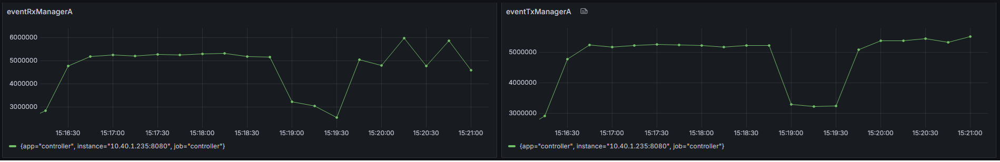</li><li>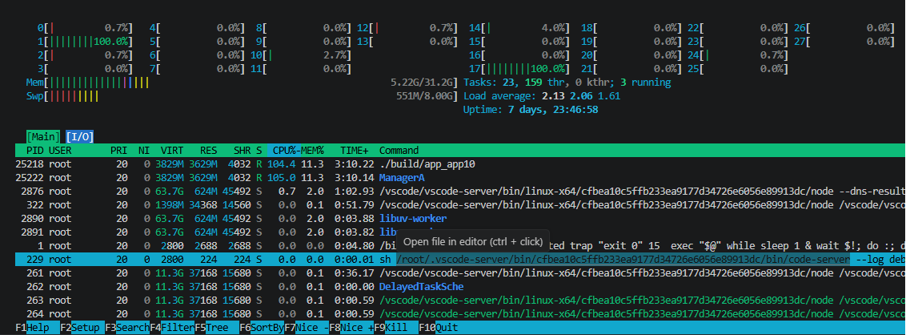</li><li>Much better then [app7.cpp](app7.cpp)</li></ul>|
|[app11.cpp](app11.cpp)|<ul><li>Using rigtorp::SPSCQueue</li><li>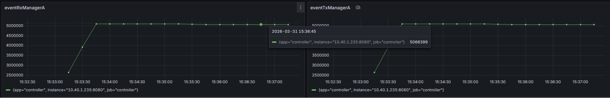</li><li>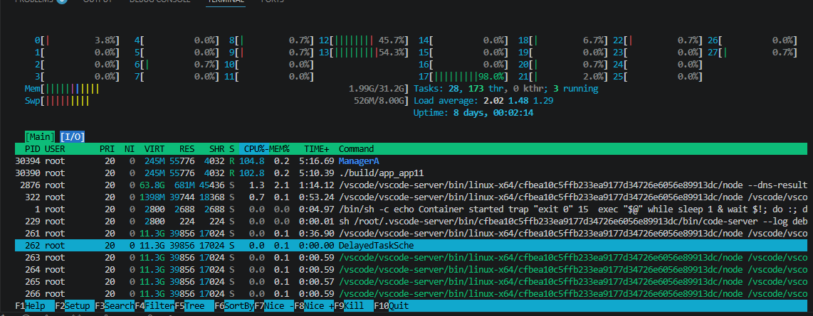</li><li>Slightly bad then [app10.cpp](app10.cpp) but moch stable/predicatble and internal implementation is very simple</li></ul>|
|[app12.cpp](app12.cpp)|EventRouter poc, basic working implementation|
